# CADia — Browser-Based AI-Native Editable CAD

> Turn any browser into an editable AI CAD workspace — no heavy desktop CAD installation required.  
> Create, select, revise, and export real B-Rep CAD models from anywhere with natural language.

**Live demo:** https://app.cadia.co.kr

**Demo videos**
- **Demo Video 1 — creation, assembly, and manufacturing handoff:** https://youtu.be/L2ocXoW0v_4
- **Demo Video 2 — topology-aware parametric editing:** https://youtu.be/bsyfQU5MiZ4

**Hackathon:** InfinityX Global Hackathon 2K26

**Evaluation docs**
- **Judge quickstart:** [`docs/JUDGE_GUIDE.md`](./docs/JUDGE_GUIDE.md)
- **Demo 1 workflow:** [`docs/DEMO_01_CREATION_ASSEMBLY_MANUFACTURING.md`](./docs/DEMO_01_CREATION_ASSEMBLY_MANUFACTURING.md)
- **Demo 2 editing workflow:** [`docs/DEMO_02_TOPOLOGY_EDITING.md`](./docs/DEMO_02_TOPOLOGY_EDITING.md)
- **Print & Ship implementation:** [`docs/PRINT_AND_SHIP.md`](./docs/PRINT_AND_SHIP.md)

**Supporting materials**
- **Modeling evidence:** [`evidence/`](./evidence/README.md)
- **Architecture:** [`docs/ARCHITECTURE.md`](./docs/ARCHITECTURE.md)

CADia turns the browser into an AI-native CAD workspace. Users do not need to install a large desktop CAD package just to create, inspect, modify, or export a model. A student, maker, founder, judge, or non-specialist can open the web workspace, describe a part, select exact faces or edges, keep revising the same real B-Rep CAD model, and export downstream files such as STEP, STL, 3MF, and G-code-oriented outputs.

CADia is built around editable CAD state rather than one-shot visual generation. Native parametric models retain feature/history-aware state, while imported STEP/BREP geometry can be edited through direct CAD operations. The AI handles intent and tool planning; typed CAD operations execute against an OCCT/CadQuery kernel that owns the geometry and model state.

CADia also includes an experimental engineering-drawing-to-CAD workflow, allowing selected engineering drawings to be used as visual input for reconstructing editable B-Rep models.

## The engineering problem

Traditional CAD workflows are powerful, but they often require heavy desktop installation, workstation setup, device-specific access, CAD command knowledge, feature-history understanding, topology references, and export workflows. That makes CAD difficult for people who can describe the part they need but cannot easily install, learn, or operate a full CAD environment.

A first generated shape is also not enough. Real design work requires repeated changes to the same model: preserving dimensions, selecting exact faces or edges, changing driving parameters, regenerating dependent geometry, verifying the result, and handing the model off to downstream CAD or manufacturing tools.

CADia focuses on that harder second half of the workflow. It is not only a text-to-3D generator. It is a browser-based editable CAD workflow where natural language, direct geometric selection, topology-aware rebinding, feature-history modification, verification and manufacturing export all operate on the same evolving B-Rep model.

## For judges

The fastest evaluation path is the live guest workspace: open the demo, click **Launch CADia**, inspect the CAD workspace and selection tools, then optionally connect a supported AI provider for a live creation-and-editing run. The concise walkthrough is in [`docs/JUDGE_GUIDE.md`](./docs/JUDGE_GUIDE.md).

Two complementary demo videos are provided. Demo Video 1 covers CAD creation, assembly, continued modification, and manufacturing handoff. Demo Video 2 focuses on CADia's topology-aware editing workflow: direct B-Rep face and edge selection, history-aware parameter modification, selected-edge fillet and chamfer operations, regeneration, and verification on the same evolving CAD model.

A representative two-step modeling flow is:

```text
Create an 80 x 60 x 8 mm mounting plate with four 6 mm holes positioned 10 mm from each corner.
```

then, on the same model:

```text
Change the plate thickness to 12 mm and the four holes to 8 mm diameter while preserving their offsets.
```

The [`evidence/`](./evidence/README.md) directory contains 22 saved examples with their exact prompts, preview images and available CAD/manufacturing exports.

## Modeling evidence

The [`evidence/`](./evidence/README.md) directory contains **22 CAD modeling examples** with the exact English prompt used for each run and the exported artifacts that were available from that run. Depending on the case, this includes preview images, STEP / STEP AP242, STL, 3MF, and PrusaSlicer-generated 3D-print G-code.

These files provide concrete modeling evidence for CADia's implemented capabilities.

## Evaluation results

- Standards-based mechanical components: **70/70 successful**
- Open-ended object generation: **41/50 exact, 6/50 partial, 3/50 failed**
- Natural-language CAD editing: **37/40 successful, 3/40 mismatched**

### Example output gallery

| Spur gear | U-shaped bracket | Laptop assembly | Clock assembly |
| --- | --- | --- | --- |
| 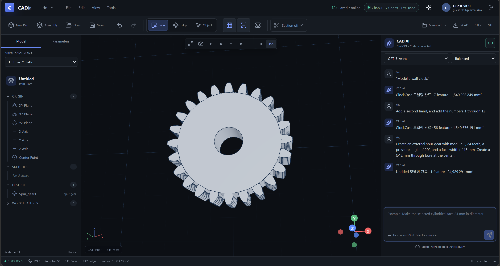 | 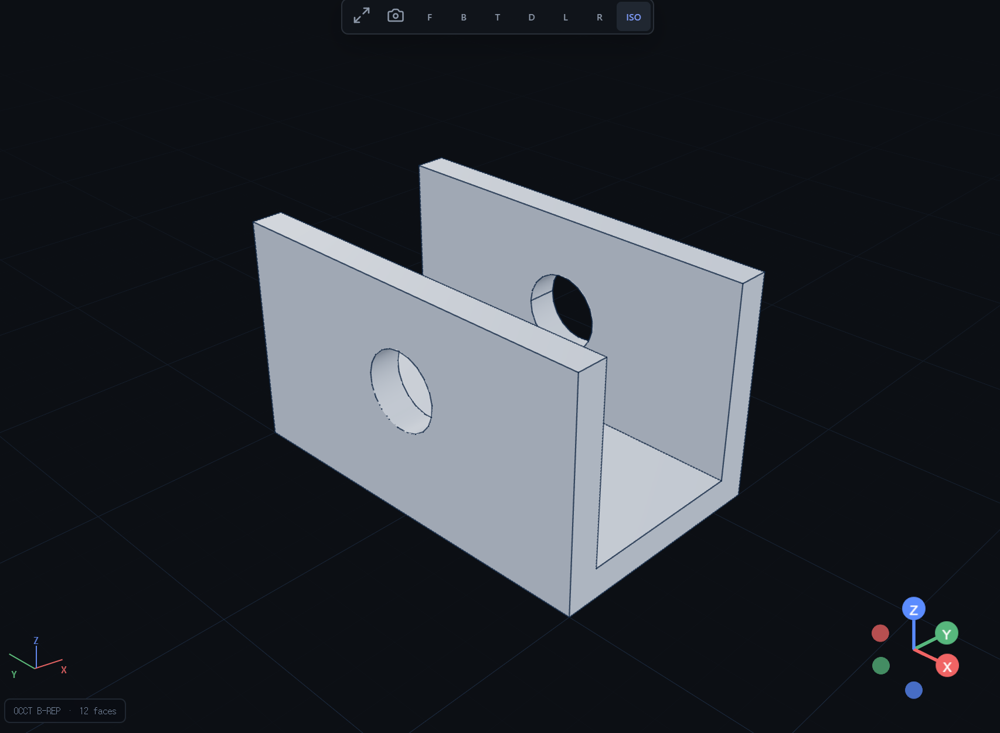 | 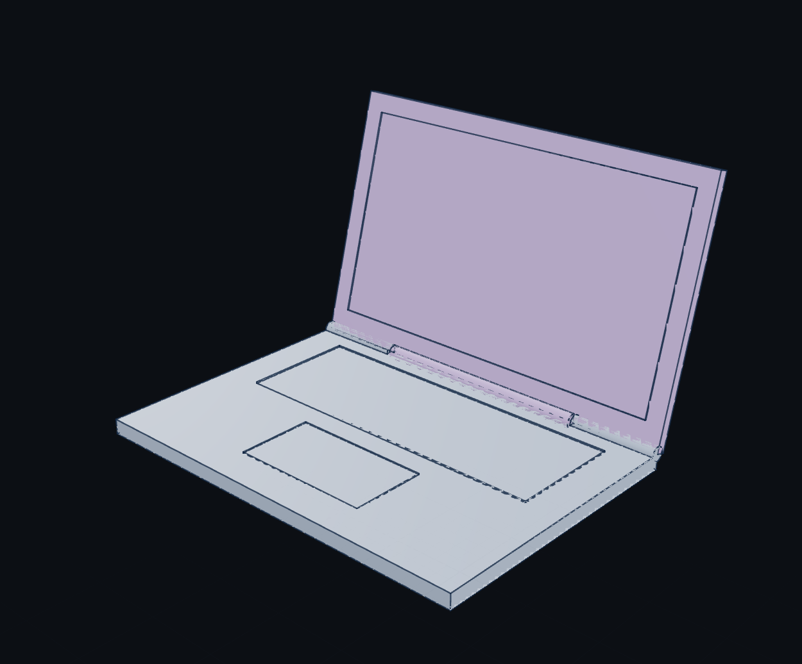 | 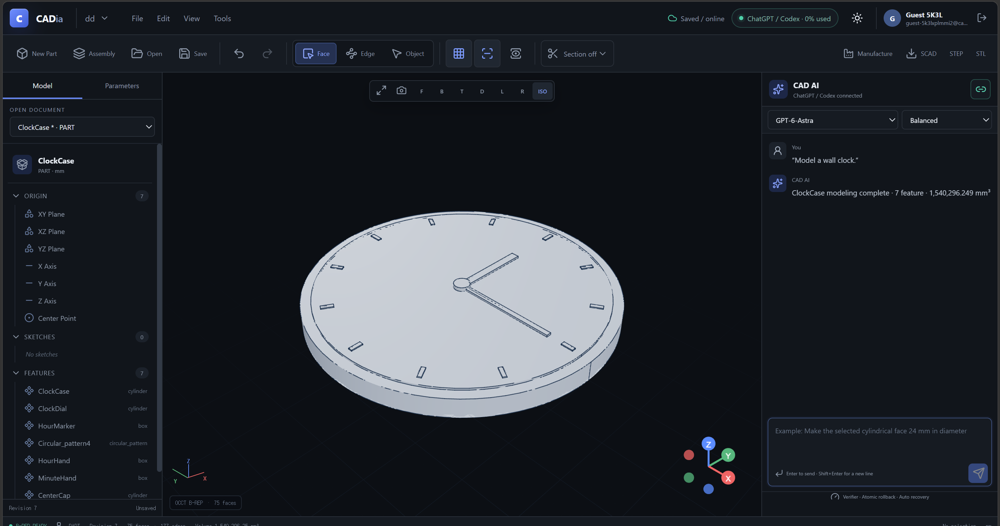 |

## Why CADia is different

Many generative 3D workflows focus on visual or mesh output. CADia is built around browser access, editable CAD state, and downstream CAD/manufacturing handoff.

| Workflow | Limitation | CADia difference |
| --- | --- | --- |
| Traditional desktop CAD | Heavy installation, workstation dependency, device constraints, and a steep command-learning curve | Browser-based CAD workspace with natural-language control and no required local CAD installation |
| One-shot AI 3D / mesh tools | A first shape may look good but is often difficult to keep editing as engineering CAD | Real B-Rep CAD state with follow-up editing on the same model |
| Manual CAD edits | Users must know exact commands, feature history, topology references, and export steps | Direct face/edge/object selection plus typed CAD operations |
| Local-only workflow | Work is tied to one installed machine and a specific workstation setup | Create, review, modify, and export from a browser across locations and devices |
| Visual-only output | The result may not continue into CAD or manufacturing workflows | STEP, STL, 3MF, DFM, slicing, and G-code-oriented downstream handoff |

| Capability | CADia approach |
| --- | --- |
| Geometry | Boundary Representation (B-Rep) through OCCT/CadQuery |
| Start point | Create a new model or continue from existing CAD geometry |
| AI control | Structured, typed CAD operations instead of free-form mesh synthesis |
| Continuous editing | Follow-up requests modify the current model instead of forcing one-shot regeneration |
| Direct selection | Face, edge, object and feature-aware editing workflows |
| History-aware editing | When a selected change maps unambiguously to model history, update the driving feature/parameter and rebuild downstream geometry |
| Direct B-Rep editing | Use direct geometry editing paths when history-based modification is unavailable or inappropriate |
| Topology | Persistent face/edge descriptors with rebinding after topology changes; ambiguous matches are rejected |
| Reliability | Per-call savepoints, kernel-feedback continuation, verification, outer rollback and bounded legacy recovery |
| Broader CAD workflows | Parametric features, sketches, assemblies, constraints, joints and standard-component generators |
| Downstream handoff | STEP, STL, 3MF, 3D-print DFM and slicing/G-code workflows |
| Web accessibility | Browser-based access so CAD creation, editing and export are not tied to a single installed desktop CAD workstation |

## The core idea

```text
Natural language + direct geometric selection
        |
        v
AI planning / structured tool selection
        |
        v
Typed CAD operations (project-scoped MCP surface)
        |
        v
OCCT / CadQuery B-Rep kernel
        |
        v
Per-call savepoints + kernel feedback + bounded recovery
        |
        v
Editable parametric model + feature history
        |
        v
Assembly / STEP / manufacturing workflow
```

The language model is not the geometry kernel. It interprets the user's design intent and chooses structured operations; the deterministic CAD system performs those operations and owns the model state.

### Full-request planning with deterministic execution

Free-form chat is interpreted against the complete user request, current CAD state, selection context and typed tool catalog before CAD operations are chosen. Plans are schema-validated before execution, and the resulting typed operations run through deterministic geometry generators and the CAD kernel.

## Algorithms under the hood

CADia's central technical problem is keeping a generated CAD model editable after the first result appears. The system combines AI planning with deterministic CAD algorithms for topology, history, parameter resolution and transaction safety.

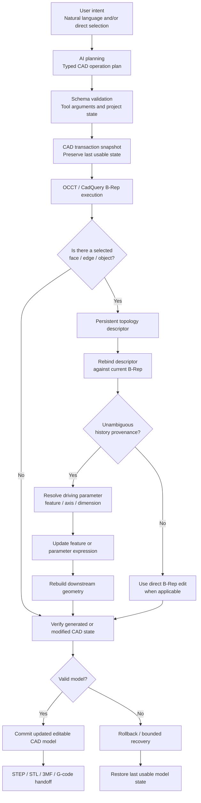

| Algorithmic layer | What CADia does |
| --- | --- |
| Persistent topology descriptors | Stores stable descriptors for selected faces and edges using CAD topology class, geometric type, position, normal/direction, size and surrounding context rather than relying on transient viewport triangle IDs. |
| Topology rebinding | After a rebuild, Boolean, fillet or direct edit changes the B-Rep, CADia rematches selections against the updated shape and rejects ambiguous candidates instead of guessing. |
| Feature-history provenance tracing | For native parametric documents, CADia walks feature-stage shapes to determine where a selected face or edge originated when that relationship can be established safely. |
| Driving-parameter resolution | When a selected face maps to a feature, CADia compares geometric direction, feature axis and editable dimensions to decide whether the user's edit should change length, width, height, radius, diameter or extrusion distance. |
| Parametric regeneration | A successful history edit updates the source feature or parameter expression and rebuilds downstream geometry, so the result remains part of the CAD model instead of a disconnected visual patch. |
| Direct B-Rep fallback | Imported geometry or edits without a reliable history path can still use direct CAD operations when applicable. |
| Kernel-feedback recovery | Plan execution uses per-call savepoints. When a later call fails, the failing call is rolled back while the successful prefix is preserved, and the planner can continue from the actual intermediate CAD state and kernel error. If continuation cannot complete, CADia restores the outer snapshot and falls back to the legacy atomic recovery path. |

A typical selected-face edit resolves as:

```text
Selected B-Rep face
        |
        v
Persistent topology descriptor
        |
        v
Rebind against current B-Rep shape
        |
        v
Trace feature-history provenance when available
        |
        v
Resolve the driving parameter or direct-edit route
        |
        v
Regenerate downstream geometry
        |
        v
Verify result, then commit or rollback
```

### Algorithm map

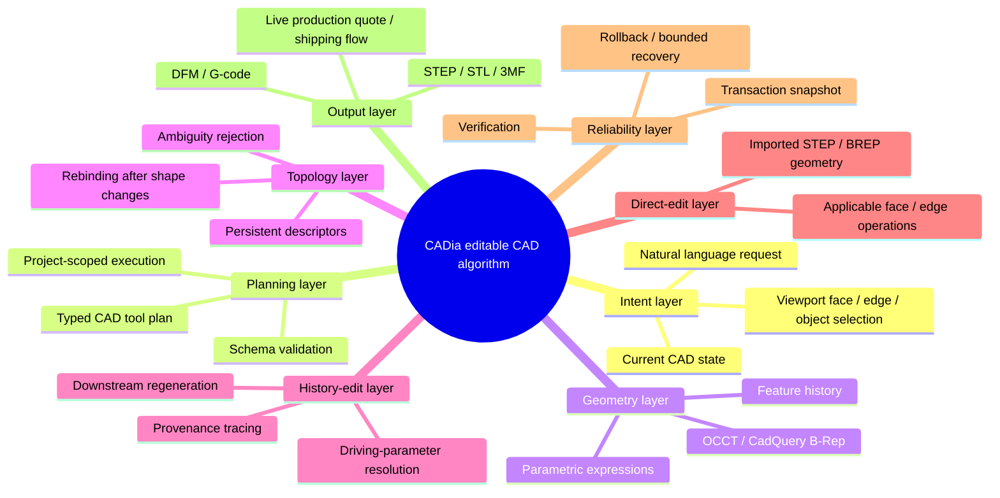

This is the difference between generating a 3D object once and maintaining an editable engineering model through repeated design changes.

## Technical highlights

### Real parametric B-Rep

CADia uses Open CASCADE through CadQuery/OCP. The model is composed of CAD faces, edges, features and parameters rather than being treated as a final triangle mesh.

### Selection-aware topology tracking

The browser passes selected faces, edges, objects and features back to the CAD runtime so edits can target explicit geometry. CADia stores topology descriptors for selected entities, rebinds references after model changes using geometric and history context, and rejects ambiguous matches.

### History-aware parametric modification

For models with usable feature history, CADia can trace an unambiguous selected edit back to the originating feature or driving parameter. The system updates that parameter/feature and rebuilds downstream geometry so the change remains part of the parametric model rather than becoming an isolated visual patch.

### Direct editing beyond feature history

For imported geometry or operations without a usable history path, CADia supports direct B-Rep editing for applicable face/edge operations. This lets the same interaction model span native parametric documents and directly editable B-Rep geometry.

### Continuous follow-up modification

A modeling session is not treated as a one-shot prompt. Users can create or open a model, make a follow-up request, select a particular region, modify it again, inspect the result, and continue from the same CAD state.

### How a CAD edit is resolved

A typical edit passes through the following path:

1. **Identify intent and target.** The request can use natural language, a direct viewport selection, or both.
2. **Resolve CAD topology.** Face/edge/object selections are connected back to B-Rep topology rather than being treated only as rendered triangles.
3. **Prefer a history-aware edit when it is unambiguous.** If the selected geometry can be traced unambiguously to an originating feature or driving parameter, CADia changes that source value/feature.
4. **Rebuild downstream geometry.** Dependent features are regenerated from the changed model state.
5. **Use direct B-Rep editing when a history path is not appropriate.** Applicable face/edge operations can modify the B-Rep directly.
6. **Rebind topology references.** Persistent descriptors are used to reconnect selections after the shape changes; ambiguous matches are rejected.
7. **Verify the transaction.** If an operation leaves the model invalid, rollback/recovery paths protect the last usable state.

This hybrid path is what lets CADia focus on **continued editing of real CAD**, not only first-pass text-to-3D generation.

### Verification and recovery

Modeling operations use per-call savepoints and bounded kernel-feedback continuation. If a tool call fails after earlier calls have succeeded, CADia can preserve that successful prefix, inspect the real intermediate CAD state and kernel error, and replan only the unfinished work. If the continuation path cannot finish safely, the request-level snapshot is restored and the existing atomic recovery path remains available as a fallback.

### Assemblies and joints

The standalone OCCT backend supports part placement, assembly relationships, BOM/constraint queries, interference/minimum-distance workflows, and joint semantics including rigid, rotational, slider, cylindrical, planar and ball joints.

### 118 project-scoped CAD tools

The AI-facing web gateway exposes 118 project-scoped CAD operations through the same CADia execution core. The tool surface reaches the same underlying CAD executor/core rather than reimplementing CAD behavior in each AI provider.

### Multi-provider AI without multiple CAD cores

CADia can connect ChatGPT/Codex, GitHub Copilot, OpenAI API, Claude or Gemini. Provider integration is separated from the CAD core; every supported provider ultimately operates the same CAD model and execution surface.

### Manufacturing path

The web application includes STEP AP242, STL and 3MF export, 3D-print DFM checks, PrusaSlicer-based G-code generation, direct printer delivery, and a live production-fulfillment path.

### From CAD to physical production

CADia does not stop at generating a CAD file. The same browser workflow can connect the current editable B-Rep model to real-world manufacturing.

```text
Natural-language request
        ↓
Editable B-Rep CAD
        ↓
Continuous design refinement
        ↓
Manufacturing preflight / DFM
        ↓
STL generation
        ↓
Material / color / quantity selection
        ↓
Live production quote
        ↓
Shipping options
        ↓
Physical production path
```

The **Print & Ship** workflow connects CADia to the public Slant 3D MCP service. Available production materials and colors are loaded from the provider, while the current CAD model is converted to STL and checked for printability before a live production quote is requested.

Users can then choose production quantity and calculate destination-based shipping without leaving the CAD workspace. Provider identifiers, MCP payloads, and protocol details remain internal to the application.

For the hackathon deployment, payment and final order submission are intentionally disabled server-side. Live manufacturing quotes and shipping calculation are implemented while unintended purchases are prevented.

The integration is implemented as a provider layer on top of CADia's existing manufacturing subsystem:

```text
Editable OCCT B-Rep
        ↓
CADia manufacturing runtime
        ↓
STL generation + DFM preflight
        ↓
Slant 3D MCP adapter
        ↓
Live materials / quote / quantity / shipping
```

Implementation details and endpoint flow are documented in [`docs/PRINT_AND_SHIP.md`](./docs/PRINT_AND_SHIP.md).

The broader goal is to reduce the distance between an idea and a physical object:

> **Describe it → Design it → Refine it → Verify it → Manufacture it**

CADia is designed so that a non-specialist can move from a natural-language idea to editable engineering geometry and toward a physically manufactured part through one browser-based workflow.

### Expansion roadmap

The current **Print & Ship** implementation is the first real production-provider integration built on CADia's manufacturing layer. The architecture is designed so that CADia is not tied to a single provider or a single manufacturing process.

```text
Editable CAD model
        ??CADia manufacturing system
        ??DFM / manufacturing validation
        ??Manufacturing provider integrations
        ?쒋??€ 3D printing
        ?쒋??€ CNC machining
        ?쒋??€ Sheet-metal fabrication
        ?쒋??€ Laser cutting
        ?붴??€ Additional prototyping services
        ??Price / lead time / material comparison
        ??Provider selection
        ??Ordering and delivery
```

In the future, CADia can connect the same editable CAD model and workflow to multiple manufacturing providers, compare **price, lead time, materials, and manufacturing processes**, and help users select an appropriate production route.

The architecture can also be extended into a **DFM feedback loop**. If a provider or manufacturing process identifies a production constraint, CADia could feed that constraint back into the editable model, help revise the design, and request a new quote.

> **Idea ??Editable CAD ??Engineering validation ??Manufacturing process/provider selection ??Physical product**

## Try it

1. Open https://app.cadia.co.kr.
2. Click **Launch CADia**. No CADia registration is required for the guest workspace.
3. Inspect the CAD workspace, feature tree, selection modes and export controls.
4. Click **Connect AI** to run live AI modeling with a supported provider.
5. Enter a design request, then make a follow-up modification to the same model.
6. Open **Manufacture → Print & Ship** to select a production material, request a live manufacturing quote, and calculate shipping for the current model.

Live AI modeling uses the selected provider connection. The guest CAD workspace can also be inspected without connecting an AI account.

## Example prompts

**Precision mounting plate**

```text
Create an 80 x 60 x 8 mm mounting plate with four 6 mm holes positioned 10 mm from each corner.
```

Follow-up:

```text
Change the plate thickness to 12 mm and the four holes to 8 mm diameter while preserving their offsets.
```

**Spur gear**

```text
Create a spur gear with module 2, 25 teeth, a 20 mm face width, a 15 mm bore, and a 20 degree pressure angle.
```

**Lead screw and nut**

```text
Create a lead screw and matching nut with a 20 mm nominal diameter, 4 mm pitch, and 30 degree thread angle.
```

**Piston assembly**

```text
Create a piston and cylinder assembly with a 30 mm bore, 40 mm stroke, and a 10 mm rod.
```

## System architecture

```text
Browser (React + Three.js)
        |
     HTTPS
        v
Nginx -> FastAPI application
              |
              +-> PostgreSQL project/auth state
              +-> per-project CAD runtime
              +-> OCCT / CadQuery geometry kernel
              +-> verifier / recovery / topology layer
              +-> per-user AI provider connection
```

The browser mesh is only a visualization of the CAD state; it is not the source of truth. Persistent face/edge IDs are carried from the CAD runtime into browser geometry so a click in the viewport can participate in later CAD edits.

## Technology stack

- CAD: Open CASCADE / OCP / CadQuery
- Backend: Python, FastAPI, SQLAlchemy, PostgreSQL
- Frontend: React, TypeScript, Three.js, Vite
- AI integration: Codex App Server, GitHub Copilot SDK, OpenAI API, Anthropic API, Gemini API
- Tool interface: MCP-compatible project-scoped CAD gateway
- Deployment: Docker Compose, Nginx, AWS Lightsail
- Manufacturing: STEP AP242, STL/3MF, 3D-print DFM, PrusaSlicer-based slicing/G-code, printer delivery, and Slant 3D live production quoting/shipping via MCP

## Repository map

```text
src/standalonecad/       CAD engine package (internal Python namespace), history, topology, assemblies, joints, verifier/recovery
web/backend/             FastAPI, auth, projects, AI providers, manufacturing, Slant 3D fulfillment and MCP gateway
web/frontend/            React/Three.js CAD interface, manufacturing controls and Print & Ship workflow
tools/                   Web/MCP bridges
scripts/                 Local utilities
deploy/                  Deployment and Nginx helpers
docs/                    Judge guide, architecture and demo walkthroughs
docs/PRINT_AND_SHIP.md  CAD-to-production architecture, live quoting and shipping workflow
SUBMISSION_SCOPE.md      InfinityX submission scope and submitted capability summary
```

## Run locally with Docker

Prerequisites: Docker Engine with Docker Compose.

```bash
cp .env.example .env
```

Set at least `POSTGRES_PASSWORD` and `NEXIS_SESSION_SECRET` in `.env`, then run:

```bash
docker compose up --build
```

The application binds to `127.0.0.1:8000` by default.

Never commit a real `.env` file or provider credentials.

## Hackathon submission materials

- [`docs/JUDGE_GUIDE.md`](./docs/JUDGE_GUIDE.md) — short evaluation path for judges
- [`docs/DEMO_01_CREATION_ASSEMBLY_MANUFACTURING.md`](./docs/DEMO_01_CREATION_ASSEMBLY_MANUFACTURING.md) — creation, assembly and manufacturing-handoff demo
- [`docs/DEMO_02_TOPOLOGY_EDITING.md`](./docs/DEMO_02_TOPOLOGY_EDITING.md) — topology-aware parametric editing demo
- [`docs/PRINT_AND_SHIP.md`](./docs/PRINT_AND_SHIP.md) — Print & Ship implementation and endpoint flow
- [`DEVPOST_SUBMISSION.md`](./DEVPOST_SUBMISSION.md) — Devpost submission copy
- [`SUBMISSION_SCOPE.md`](./SUBMISSION_SCOPE.md) — submitted capability scope and evaluation summary

## Engineering drawing → editable CAD (experimental)

CADia can also use engineering drawings as visual design input and attempt to reconstruct them as editable B-Rep CAD models. The workflow analyzes visible dimensions, profiles, sections, holes, grooves, and other geometric information in the drawing, then routes the reconstructed model into the same CADia editing and export workflow used for natural-language modeling.

### Current capabilities

- Engineering drawings can be used as input for CAD reconstruction.
- Dimensioned orthographic and section views can provide geometric context.
- CADia attempts to reconstruct the result as editable B-Rep geometry.
- Successful reconstructions can continue through CADia's existing editing and export workflow.
- Clear, well-defined engineering drawings currently produce the most reliable results.

### Current limitations

Drawing-to-CAD is still experimental. Difficult or ambiguous drawings can produce missing features, incorrect geometry, or disconnected intermediate solids.

In a small internal evaluation using selected engineering drawings, approximately **50% of the tested cases produced end-to-end reconstructions that were considered sufficiently faithful to the source drawing**. This is an internal development measurement rather than a standardized benchmark, and performance varies substantially with drawing complexity and clarity.

**Try it:** Upload an engineering drawing at https://app.cadia.co.kr.

### Drawing-to-CAD examples

<table>
<tr>
<th>Engineering drawing</th>
<th>CADia reconstruction</th>
</tr>
<tr>
<td align="center">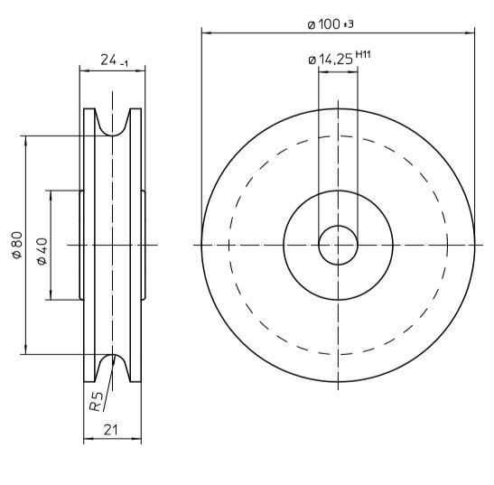</td>
<td align="center">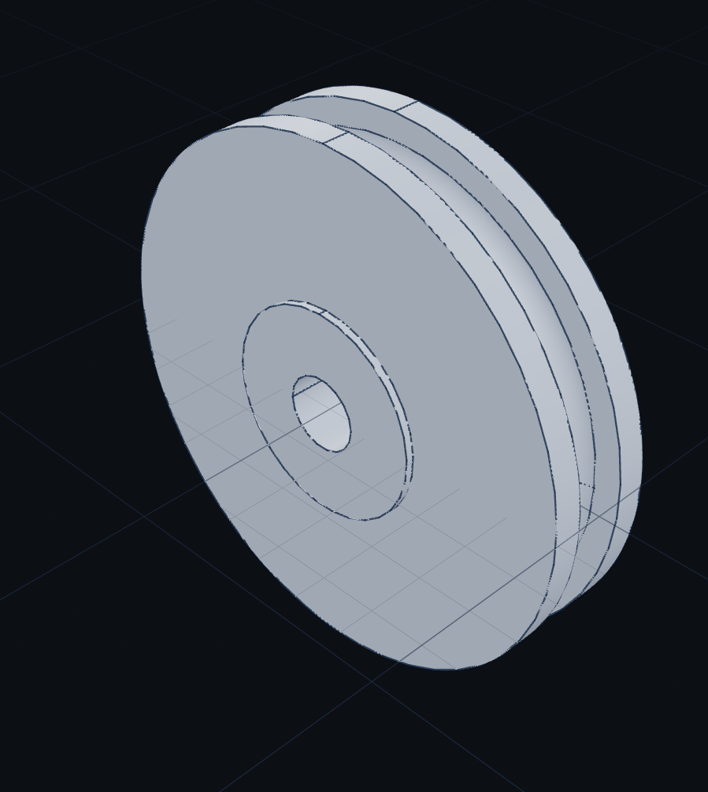</td>
</tr>
<tr>
<td align="center">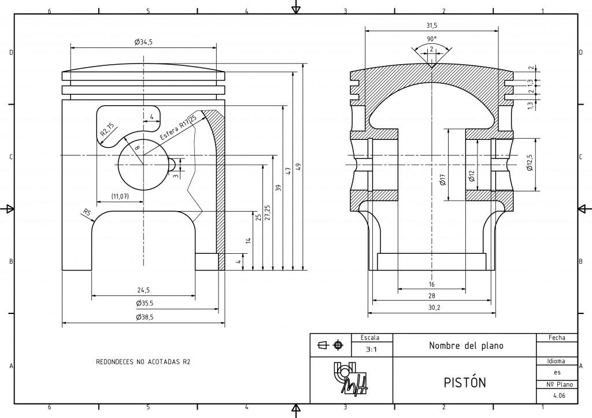</td>
<td align="center">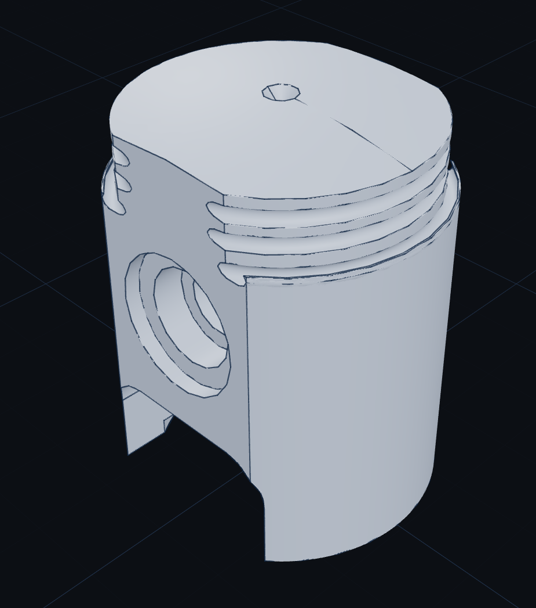</td>
</tr>
<tr>
<td align="center">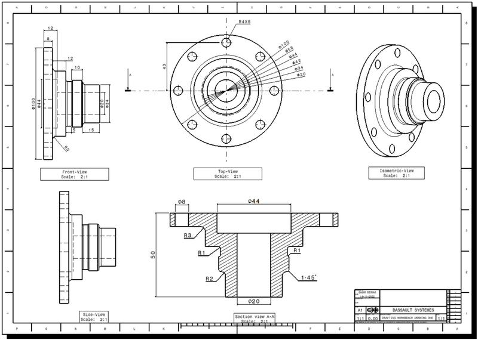</td>
<td align="center">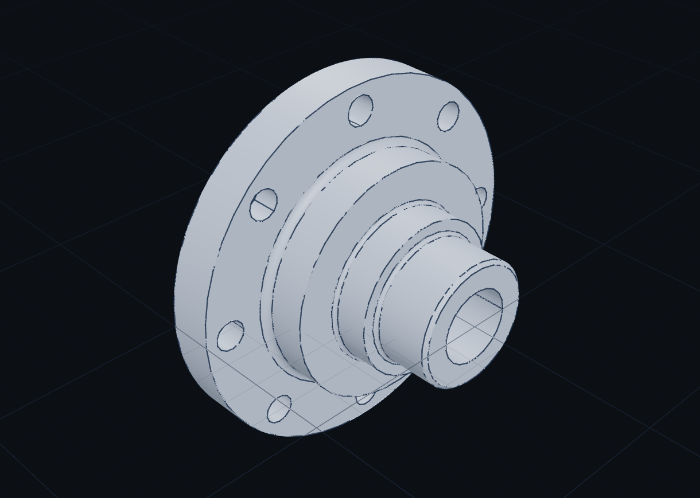</td>
</tr>
<tr>
<td align="center">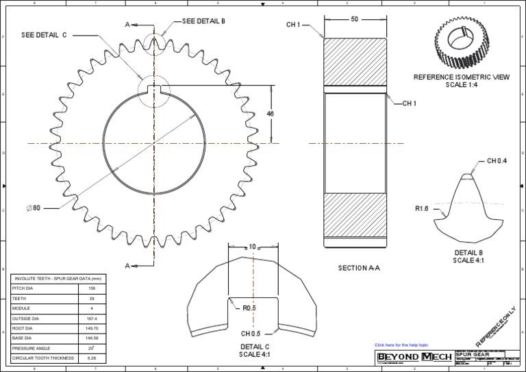</td>
<td align="center">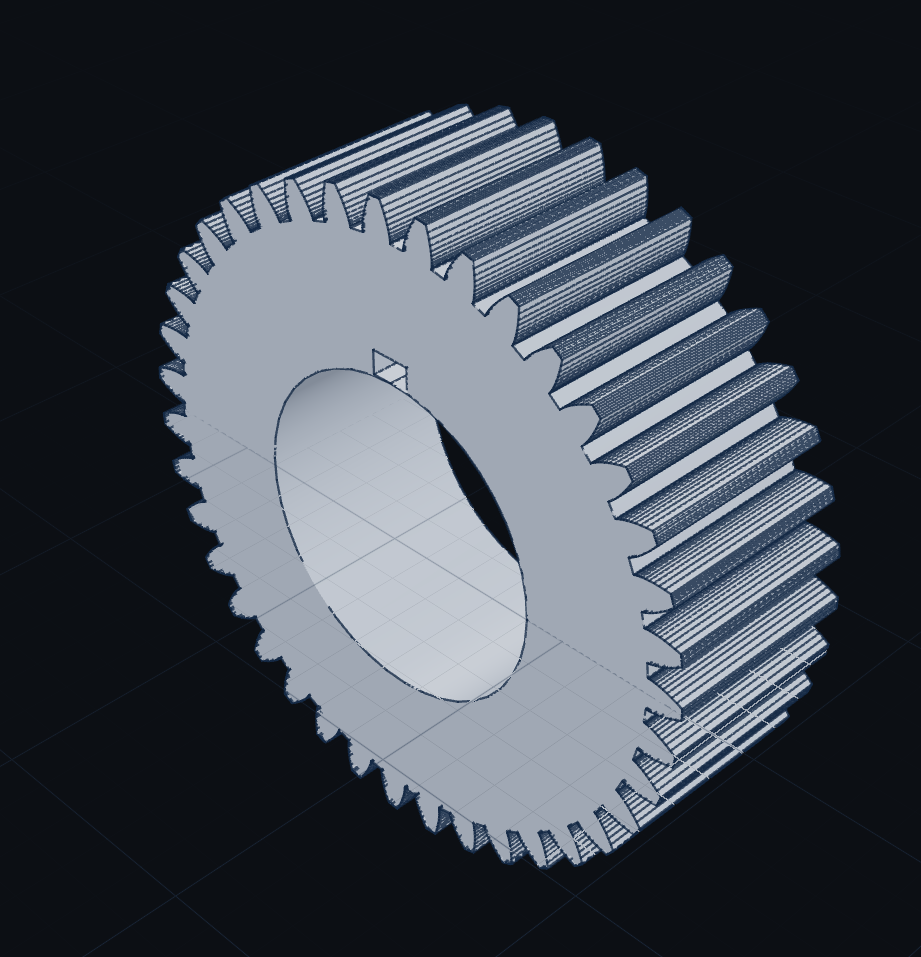</td>
</tr>
</table>

At **app.cadia.co.kr**, click **Drawing → CAD** and upload an engineering drawing image to try it.

## Third-party software

See `THIRD_PARTY.md`. Dependencies remain subject to their respective upstream licenses.
